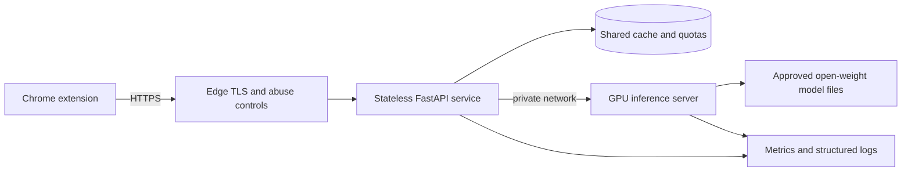

# Production hosting architecture

Status: proposed architecture, pending GPU benchmarks and product-volume data.

No cloud resource or model download is part of this checkpoint.

## Recommended boundary

The production system should separate the public API from GPU inference even if the
first deployment temporarily runs them on one machine:

This boundary keeps the extension independent from any inference engine and lets us
change Ollama, vLLM, SGLang, a translation model, or a hybrid pipeline without
changing `contracts/openapi.json`. Model files are infrastructure data; they are not
copied into the API image or extension.

## What Docker solves

The repository Dockerfile packages only the FastAPI control plane. It gives staging
and production the same Python runtime, dependency versions, non-root user, health
check, and startup command. It does not download weights and it does not imply that
all services belong in one container.

For the first measured GPU experiment, an inference image can be deployed separately
and addressed through a private endpoint. For a small always-on production launch,
Docker Compose on one GPU VM is acceptable as a reversible cost-saving step:

- reverse proxy/TLS;
- FastAPI;
- Redis-compatible cache and quota state;
- one GPU inference server;
- metrics collector.

The API and inference containers should be split onto separate machines when either
needs independent scaling. Kubernetes is deliberately deferred until traffic or
availability requirements justify its operational cost.

## Serving engine direction

Ollama remains useful for local contract and qualitative tests. It is not the
preferred production engine because the product needs concurrent batching,
structured-output constraints, and production metrics.

The first GPU benchmark should use vLLM as the baseline serving engine. Its official
documentation exposes [JSON-schema structured outputs](https://docs.vllm.ai/en/latest/features/structured_outputs/),
an HTTP serving layer, quantization options, and production metrics. SGLang remains a
serious comparison candidate because it also supports
[structured outputs](https://docs.sglang.io/docs/advanced_features/structured_outputs).
This is a serving-engine recommendation, not a model selection.

The FastAPI provider interface should gain an inference-HTTP adapter after a model
shortlist exists. The current Ollama adapter must not be renamed into a generic
production adapter: request formats and readiness semantics differ between engines.

## Hosting options to measure

### GPU pod for evaluation and early staging

Runpod Secure Cloud supports custom containers and dedicated on-demand Pods. Its
[official pricing documentation](https://docs.runpod.io/pods/pricing) says compute is
billed by usage and current GPU prices must be checked at deployment time. Pods do
not support Docker Compose, according to the
[Pod overview](https://docs.runpod.io/pods/overview), so this option is best treated
as an inference-only host behind a separately deployed API.

Advantages:

- quick disposable GPU benchmark environment;
- broad GPU choice;
- no long commitment for initial measurements.

Risks:

- price and availability vary by GPU;
- storage lifecycle and private networking require explicit configuration;
- a stopped or cold service is incompatible with instant subtitle interaction.

### European always-on GPU VM

Scaleway publishes an L4 instance with 24 GB VRAM at EUR 0.79/hour, approximately
EUR 575/month before tax, storage, and IP charges as of 15 July 2026. The current
price must be rechecked on the
[official GPU pricing page](https://www.scaleway.com/en/pricing/gpu/) before any
creation. This class of VM can host the early single-machine Docker Compose topology
and offers predictable warm latency.

Advantages:

- European region and a conventional VM/network model;
- predictable always-warm service;
- enough VRAM to benchmark compact quantized candidates.

Risks:

- substantial fixed idle cost before there is traffic;
- 24 GB VRAM constrains model and quantization choices;
- one VM is not high availability.

### Serverless GPU

Serverless GPU should be benchmarked only as a cost alternative. A scale-to-zero
worker introduces model-load cold starts; an active warm worker recreates much of the
fixed cost of a Pod. It is not the default recommendation for interactive subtitles
until measured p95 latency proves otherwise.

## Provisional deployment progression

1. **Now, free/local:** validate the Docker API, extension environment builds,
   request cancellation, YouTube lifecycle, and evaluation dataset.
2. **Approved benchmark:** create one short-lived GPU resource, manually install one
   approved model, and compare vLLM/SGLang latency and schema validity.
3. **Staging:** stable HTTPS API URL, exact extension-origin CORS, one warm inference
   worker, bounded cache, anonymous installation quota, and dashboards.
4. **Early production:** one warm GPU plus a replaceable CPU API/cache plane; choose
   single-host Compose or split hosts from measured cost.
5. **Scale-out:** multiple API replicas and GPU workers only after queue time, cache
   hit rate, and saturation metrics show a need.

## Security and traffic controls still required

- TLS termination and private API-to-inference networking;
- no static secret treated as confidential inside the extension;
- short-lived installation tokens and anonymous per-installation quotas;
- rate limiting at the edge and application layer;
- cache keys including schema, provider/model revision, language pair, text, and
  context;
- subtitle text excluded from logs by default;
- exact production extension ID in CORS and the packaged manifest;
- inference endpoint inaccessible directly from the public internet;
- pinned image digests and dependency scanning before deployment.

Cloudflare Workers has a programmable
[rate-limiting API](https://developers.cloudflare.com/workers/runtime-apis/bindings/rate-limit/),
but Cloudflare is only one possible edge implementation and is not selected here.

## Decision gates

Before downloading a model or paying for GPU capacity, present:

- exact model and upstream revision;
- verified commercial-use license from the official source;
- weight and disk size;
- target quantization and expected VRAM;
- serving image/version;
- GPU type, region, hourly price, maximum experiment duration, and spend cap;
- acceptance thresholds for quality, JSON validity, warm p50/p95, and throughput;
- deletion/stop procedure after the benchmark.

The final hosting provider and model/pipeline strategy remain deliberately undecided
until those measurements exist.
